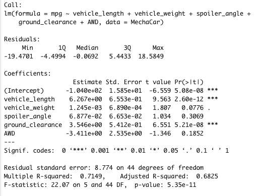
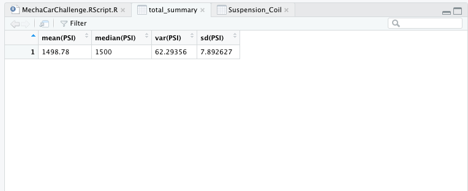
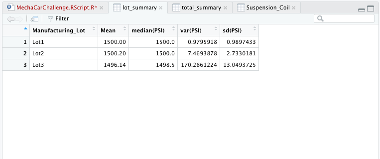
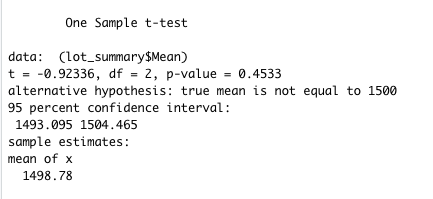

# MechaCar_Statistical_Analysis

## Linear Regression to Predict MPG

The variables/coefficients that provided a non-random amount of variance to the mpg values in the dataset include vehicle_length and ground_clearance. Both of these coefficients have probability values well below 0.05 which indicate it is a very highly statistically unlikely any variance observed is due to chance.

The slope of the linear model can be considered to be zero because the probability value of our intercept is 5.08e-08 which is almost zero.

## Summary Statistics on Suspension Coils
Current manufacturing data shows that all manufacturing lots in total meet the design specifications. The variance in PSI for all lots is 62.29 which is less than what is allowed by the design specification requirements (not to exceed 100 PSI).

Manufacturing lots 1 and 2 meet the design specifications as their variance in PSI are less than 100 PSI (0.98 and 7.47 respectively). Manufacturing Lot 3 however does not meet the design specifications (variance of 170.29 PSI).

## T-Tests on Suspension Coils
The t-test results comparing the PSI across all manufacturing lots showed a p-value of 0.45 which is below a significance level of 0.05%. With this result, we can reject the null hypothesis, meaning PSI is statistically different across all manufacturing lots.

## Study Design: MechaCar vs Competition
A consumer study of interest comparing the MechaCar to a competitor would be the fuel efficiency of the vehicles. Our null hypothesis in this study would be there is no difference in the fuel efficiency of the MechaCar compared to the competitor vehicle. Our alternative hypothesis in this study would be the MechaCar is more fuel efficient compared to the competitor vehicle.

The statistical test that would be used to test this hypothesis would be a one-way ANOVA test. An ANOVA test is best suited for this study as we are comparing multiple variables across a number of groups (different types of MechaCar vehicles against the competition).

In order to run this statistical test, we would need to have data on fuel consumption (mpg) for the different MechaCar vehicles and also for the competitor vehicle. 
